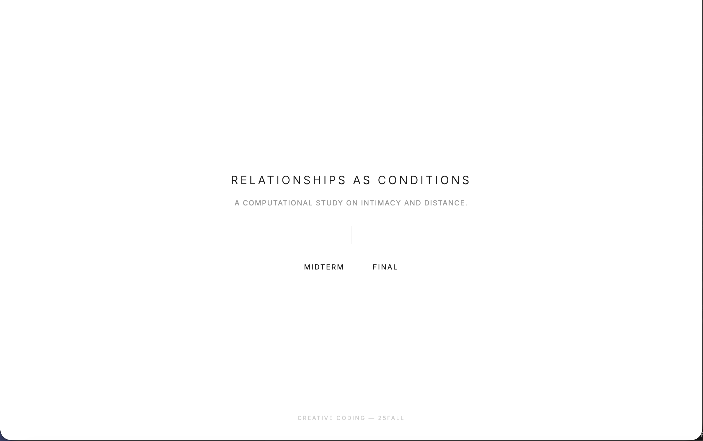
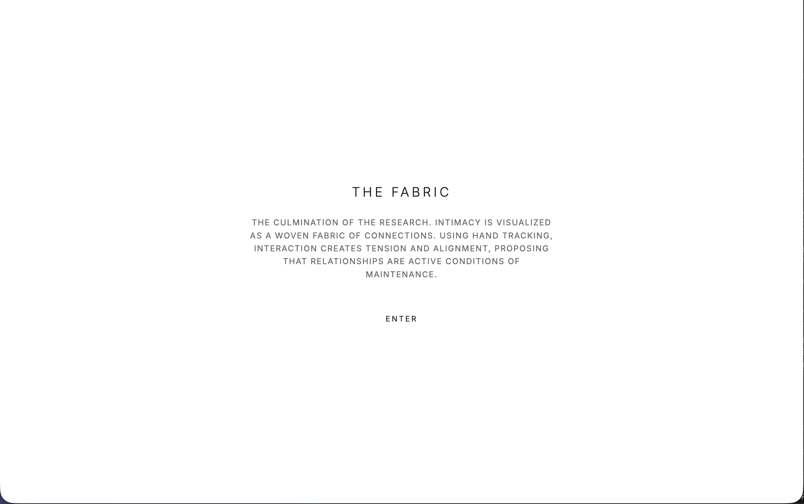
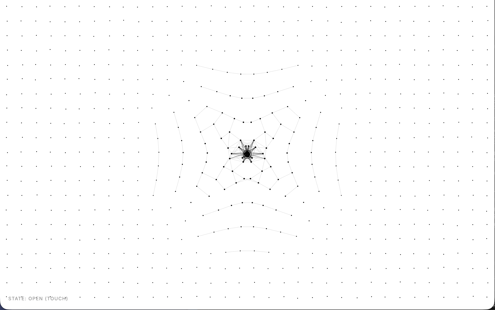

# THE FABRIC
### A Computational Study on Relational Mechanics

> *"Relationships are not static objects found in the dark; they are active conditions of maintenance."*

---

## Gallery

---

## 01 Concept: The Resilience of Relations

**"The Fabric"** is a visualization of human emotional mechanisms.

While the Midterm studies explored physical "distance and boundaries," this Final Project delves into the **viscosity and elasticity** of relationships. I reimagine the interpersonal network as a "woven fabric"—where no node exists in isolation; each is defined by the tension of its neighbors.

In this mechanics, interaction becomes metaphor:
*   **Touch (Open Hand)**: Represents gentle intervention. The fabric breathes with the gesture, its structure fluctuating yet remaining intact.
*   **Grip (Closed Fist)**: Represents tension and possession. The grid collapses violently toward the center. When this force is excessive, the ordered connections are twisted beyond recognition.

---

## 02 Evolution: From Coordinate to Body

Moving from mouse clicks to hand tracking is not just a technical substitution, but an **elevation of interaction dimension**.

1.  **Embodied Cognition**: By integrating **ml5.js (HandPose)**, the user shifts from an "operator" to a "participant." This process, where movement triggers systemic change, mirrors the real-world sensation that "a slight move in one part may affect the whole situation."
2.  **Visual Subtraction**: I intentionally stripped away decorative elements, adopting a **"Museum Minimalist"** aesthetic. The expansive whitespace and asymmetrical grid ensure that every vibration of the lines carries weight.

---

## 03 Challenge: Physics with Memory

### The Memory Trace

In early tests, the grid's elasticity was too mechanical—the moment the hand released, everything snapped back instantly. This "zero-memory" physics made the piece feel lifeless.

**The Solution:**
I rewrote the casing logic of the physics engine to introduce a **non-linear "healing" process**.

*   **Active State**: High Sensitivity. The fabric captures the slightest tremor of the fingers instantly.
*   **Recovery State**: Extremely low viscosity. When the hand leaves, the grid does not vanish immediately but lingers like a "muscle memory," slowly smoothing out over time.

This **"delayed fading scar"** is my core expression regarding time and emotion.

---

## 04 Technical Stack

*   **Core**: HTML5 Canvas / Vanilla JavaScript (ES6+)
*   **Interaction**: [p5.js](https://p5js.org/) (Rendering) / [ml5.js](https://ml5js.org/) (Real-time Hand Pose)
*   **Typography**: Inter Typeface (For precision typesetting)

---
*Fall 2025 Creative Coding Final*
